# Hi there, I'm Diya Kanwar! 👋

<div align="center">
  
</div>

<div align="center">
  
</div>

## 🌟 About Me

```javascript
const diya = {
    name: "Diya Kanwar",
    location: "Gurgaon, India 🇮🇳",
    education: "Computer Science & Engineering @ Chandigarh University",
    currentFocus: "Front-End Development & UI/UX Design",
    passion: "Creating user-centered digital experiences ✨",
    
    dailyRoutine: {
        morning: "☕ Coffee + Code",
        afternoon: "🎨 Design + Develop", 
        evening: "📚 Learn + Grow",
        night: "💭 Dream in Code"
    },
    
    funFact: "I reduce bounce rates by day and create smooth animations by night! 🌙"
};
```

<div align="center">
  
</div>

## 🚀 Tech Arsenal

<div align="center">

### 🎨 Frontend Magic


### 🛠️ Development Tools


### 💻 Programming Languages


</div>

## 📊 GitHub Analytics

<div align="center">
  
  
</div>

## 🏆 Project Highlights

<div align="center">

| 🎯 Project | 🛠️ Tech Stack | ✨ Impact |
|------------|---------------|-----------|
| **Vocal AI Assistant** | JavaScript, Speech Recognition API, Tailwind CSS | ⚡ <300ms latency, 25% faster response |
| **Client Portfolio** | React.js, Tailwind CSS, Vercel | 📈 35% faster load speed, 20% less bounce rate |
| **Expense Tracker** | React, Chart.js | ⚡ 40% faster load time, 30% user retention boost |
| **Interactive Game** | Java, Swing | 🎮 25% reduced complexity, 2x playtime |

</div>

## 🌈 Current Journey

```mermaid
graph LR
    A[🎓 Learning] --> B[💡 Ideating]
    B --> C[🎨 Designing]
    C --> D[⚡ Developing]
    D --> E[🚀 Deploying]
    E --> F[📈 Optimizing]
    F --> A
```

<div align="center">
  
</div>




## 🌍 Let's Connect & Collaborate!

<div align="center">
  
[]([https://your-portfolio-link.com](https://diya-kanwar-portfolio-craft.vercel.app/))
[](mailto:kanwardiya1@gmail.com)
[](https://linkedin.com/in/diyakanwar)
[](https://github.com/DiyaKanwar)

</div>

<div align="center">
  
</div>

---

<div align="center">
  
  
  **💭 "Code is like humor. When you have to explain it, it's bad." - Cory House**
  
  <sub>⭐ From [DiyaKanwar](https://github.com/DiyaKanwar) with 💝</sub>
</div>
